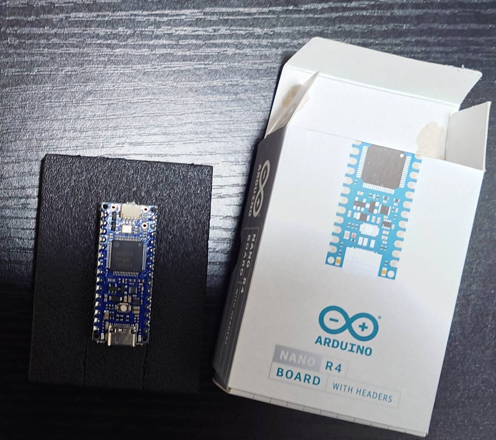

# Arduino Nano R4

| 項目 | 内容 |
|------|------|
| 型番 | ABX00087 |
| メーカー | Arduino |
| 個数 | 1 |
| クロック | 48MHz |
| フラッシュ | 256KB |
| RAM | 32KB |
| インターフェース | USB-C, UART, I2C, SPI, PWM, デジタル/アナログI/O |

## 画像

## メモ
